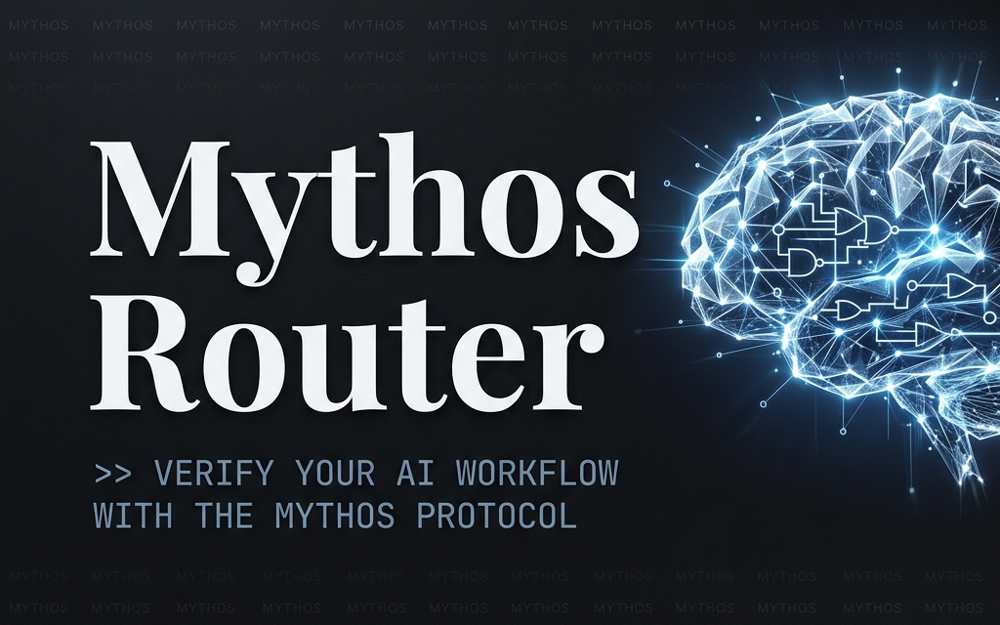

<div align="center">


[](https://github.com/thewaltero/mythos-router/actions/workflows/github-code-scanning/codeql)
[](https://www.npmjs.com/package/mythos-router)
[](https://nodejs.org)
[](https://typescriptlang.org)
[](https://anthropic.com)
[](./LICENSE)
[](https://github.com/thewaltero/mythos-router)


## Claude Opus 4.7 · Strict Write Discipline · Zero Slop
**A local CLI power tool for verifiable AI-assisted coding.**


[What is this?](#what-is-this) | [Features](#features) | [Installation](#installation) | [Usage](#usage) | [Architecture](#architecture) | [Token Budget](#token-usage--budget) | [SDK](#-sdk-usage-for-agentic-systems)

---

### Support the project
**CA: `0xb942b75a602fa318ac091370d93d9143ba345ba3` ([$MYTHOS Token](https://app.uniswap.org/swap?outputCurrency=0xb942b75a602fa318ac091370d93d9143ba345ba3&chain=base))**

---


<p align="center">
  
</p>

```bash
# Try it now
npx mythos-router chat
```

</div>

---

## What is this?

**mythos-router** is a local CLI power tool that wraps Claude Opus 4.7 with a custom verification protocol called **Strict Write Discipline (SWD)**.

Unlike standard Claude wrappers, mythos-router enforces filesystem verification: every file operation the AI claims to perform is *checked against the actual filesystem using SHA-256 snapshots*. If the model's claim doesn't match reality, it gets a Correction Turn. If it fails twice, it yields to the human.

Zero slop. Zero hallucinated state. Full adaptive thinking.

---

## Features

| Feature | Description |
|---------|-------------|
|  **Adaptive Thinking** | Opus 4.7 with configurable effort levels (high/medium/low) |
|  **Strict Write Discipline** | Pre/post filesystem snapshots verify every model claim |
|  **Self-Healing Memory** | Authority-based logging with a rebuildable SQLite FTS5 search index |
|  **Auto-Healing TDD** | Pass `--test-cmd` for bounded, error-driven autonomous repair loops |
|  **Correction Turns** | Model gets 2 retries to match filesystem reality, then yields |
|  **Integrity Gate** | `verify` command and startup hashing ensure zero drift |
|  **Token Limiter** | Budget cap with graceful save — progress saved to MEMORY.md, never lose work |
|  **Dry-Run Mode** | Preview every file operation before it executes — full transparency |
|  **Verbose Tracing** | See exactly what the AI is parsing, thinking, and verifying |
|  **Budget Analytics** | Persistent tracking of cost across sessions and projects via `stats` |
|  **Session Branching** | Isolate AI actions in a namespaced git branch (`mythos/`) |
|  **Zero Build** | Runs directly via `tsx` — no compile step in dev |

---

## Core Architectural Pillars

### 1. Configurable Model Selection
Choose the right model for the job via the `--effort` flag:

| Effort | Model | Best For |
|--------|-------|----------|
|  `high` (default) | Claude Opus 4.7 | Architecture, deep reasoning, complex refactors |
|  `medium` | Claude Sonnet 3.5 | Balanced code generation, everyday tasks |
|  `low` | Claude Haiku 3 | Quick answers, memory compression, verification |

The `dream` command automatically uses `low` effort (Haiku) for cost-efficient memory compression, and `verify` uses lightweight scanning — so you only burn Opus tokens when you need deep reasoning.

### 2. Authority-Based "Self-Healing" Memory
Most agentic systems stored state in opaque databases or messy JSON files. Mythos Router treats `MEMORY.md` as the **Sole Authority**. 

Every action is logged in Markdown first. On startup, the system verifies the integrity of the log via SHA-256 manifest hashing and reconstructs a high-performance **Derivative SQLite Index** (FTS5). If the index drifts or the database is deleted, the system self-heals by rebuilding from the authoritative Markdown source.

As memory approaches capacity, the `dream` command delegates a compression phase to a low-cost model (Haiku 3), ensuring your "Sacred Log" is always lean and relevant.

---

## Installation

### Quick Start (npm)

```bash
# Install globally
npm install -g mythos-router

# Set your API key
export ANTHROPIC_API_KEY="sk-ant-..."
# Windows: $env:ANTHROPIC_API_KEY = "sk-ant-..."

# Go
mythos chat
```

### Or try without installing

```bash
npx mythos-router chat
```

### From Source

```bash
git clone https://github.com/thewaltero/mythos-router.git
cd mythos-router
npm install
npm run chat
```

---

## Usage

### `mythos chat` — Interactive Session

```bash
mythos chat                  # Full power (high effort, Opus 4.7)
mythos chat --test-cmd "npm test" # Enable autonomous test-driven self-healing
mythos chat --effort low     # Budget mode (Haiku 3)
mythos chat --effort medium  # Balanced (Sonnet 3.5)
mythos chat --dry-run        # Preview all file changes before executing
mythos chat --verbose        # See full SWD traces and thinking
mythos chat --branch refactor # Isolate session in a fresh git branch
mythos chat --dry-run --verbose  # Maximum transparency
```

####  Financial Safety — Never Burn Money Again

```bash
mythos chat                           # Default: 500K tokens, 25 turns
mythos chat --max-tokens 100000       # Cap at 100K tokens
mythos chat --max-turns 10            # Cap at 10 turns
mythos chat --max-tokens 50000 --max-turns 5  # Tight budget
mythos chat --no-budget               # Expert mode (no limits)
```

The budget limiter tracks every token, turn, and estimated cost in real-time:

```
budget: [████████░░░░░░░░░░░░] 78,342/500,000 tokens · [██████░░░░] 12/25 turns · ~$1.2340 · 4m 32s
```

At 80%, you get a yellow warning. At 100%, the session performs a **graceful save** — current progress is written to `MEMORY.md` so you can resume context in your next session. No work lost. Use `--no-budget` to disable (at your own risk).

####  Dry-Run Mode — The Trust Builder

```bash
mythos chat --dry-run
```

In dry-run mode, every file operation is previewed before execution:

```
 DRY-RUN  ── File Action Preview ──
  2 file action(s) detected. Review each:

  1/2 MODIFY src/index.ts
  Description: Change 'axios' to 'fetch'
  Current state: 1,832 bytes, hash: 7a3f2c1e..
   DRY-RUN  Accept MODIFY on src/index.ts? [Y/n] y
  ✔ Accepted: MODIFY src/index.ts

  2/2 CREATE src/utils.ts
  Description: Add helper utilities
  Current state: does not exist
   DRY-RUN  Accept CREATE on src/utils.ts? [Y/n] n
  ⚠ Rejected: CREATE src/utils.ts
```

In-session commands:
- `/exit` — End session (shows final budget summary)
- `/memory` — Show memory status
- `/budget` — Show current budget consumption
- `/clear` — Clear conversation (memory persists)

### `mythos verify` — Zero-Drift Codebase Scan

```bash
mythos verify              # Scan and log results to MEMORY.md
mythos verify --dry-run    # Scan without writing to MEMORY.md
```

Scans every file in your project and cross-references against `MEMORY.md`:
- ✅ **Verified** — File state matches memory
- ⚠️ **Drift** — File changed but memory doesn't reflect it
- ❌ **Missing** — Memory references a file that doesn't exist

### `mythos dream` — Memory Compression

```bash
mythos dream              # Auto-compress when needed
mythos dream --force      # Force compression
mythos dream --dry-run    # Preview without writing
```

When `MEMORY.md` exceeds 100 entries, older logs are compressed into a summary block using Claude (low effort, minimal token burn). Recent entries are preserved intact.

### `mythos stats` — Budget Analytics & Cost Profiling

```bash
mythos stats              # Show all-time token usage and costs
mythos stats --days 7      # Filter for the last week
```

Tracks every penny spent across all your projects. Costs are aggregated by:
- **Command** (e.g., `chat` vs `dream`)
- **Project** (directory name)
- **Time Period**

Data is stored locally in `~/.mythos-router/metrics.json`.

### 🔌 SDK Usage (For Agentic Systems)

`mythos-router` exposes its Strict Write Discipline engine for programmatic use:

```typescript
import { SWDEngine, parseActions } from 'mythos-router';

// 1. Create an engine instance with your preferred options
const engine = new SWDEngine({
  strict: true,
  enableRollback: true,
  onAction: (action) => console.log(`Executing: ${action.operation} ${action.path}`),
  onVerify: (result) => console.log(`${result.status}: ${result.detail}`),
});

// 2. Let your agent generate code (must output [FILE_ACTION] blocks)
const agentOutput = await myAgent.generateCode();

// 3. Parse the agent's output and route through the SWD engine
const actions = parseActions(agentOutput);
const result = await engine.run(actions);

if (result.success) {
  console.log('✅ Agent execution verified securely');
} else {
  console.log('❌ Agent hallucinated a write. Rolled back:', result.rolledBack);
  console.log('Errors:', result.errors);
}
```


---

## Architecture

```
mythos-router/
├── src/
│   ├── cli.ts           # Commander.js entry point
│   ├── config.ts        # System prompt + constants + budget defaults + validation
│   ├── client.ts        # Anthropic SDK (adaptive thinking, streaming)
│   ├── budget.ts        # Session budget limiter (token cap, turn cap, progress bar)
│   ├── swd.ts           # SWD execution kernel (engine, types, parsing, snapshots)
│   ├── swd-cli.ts       # SWD terminal presentation (verification output, dry-run)
│   ├── memory.ts        # MEMORY.md self-healing manager (SQLite FTS5 index)
│   ├── metrics.ts       # Global metrics store (persistent budget tracking)
│   ├── diff.ts          # Myers' diff algorithm (zero-dependency)
│   ├── git.ts           # Git operations (branching, committing)
│   ├── utils.ts         # Terminal formatting, badges, prompts (zero-dep ANSI)
│   ├── index.ts         # Public SDK exports
│   └── commands/
│       ├── chat.ts      # Interactive REPL (ChatSession + ChatUI abstraction)
│       ├── verify.ts    # Codebase ↔ Memory scanner (dry-run aware)
│       ├── dream.ts     # Memory compression (dry-run aware)
│       └── stats.ts     # Budget analytics reporter
├── test/                # Automated test suite (node:test)
├── .mythosignore        # SWD scan exclusions
├── MEMORY.md            # Auto-generated agentic memory
└── AGENTS.md            # Project conventions
```

### The SWD Protocol

```
User Input
    │
    ▼
[Claude Opus 4.7] ── adaptive thinking
    │
    ▼
[Parse FILE_ACTION blocks] ── extract claimed operations
    │
    ▼
[Snapshot referenced files] ── targeted filesystem state capture
    │
    ▼
[Verify] ── model claims vs. actual filesystem
    │
    ├── ✅ All verified → Log to MEMORY.md
    │
    └── ❌ Mismatch → Correction Turn (max 2 retries)
                │
                └── Still failing → Yield to human
```

---

## MEMORY.md — Should You Commit It?

**Yes.** `MEMORY.md` is designed to be committed to your repository. It becomes a "collaborative brain" where:
- Multiple developers can see what the AI did in previous sessions
- Different AI agents can reference past context
- You get a full audit trail of every AI-assisted file operation

If you prefer to keep it private, add `MEMORY.md` to your `.gitignore`.

---

## Configuration

| Env Variable | Required | Description |
|-------------|----------|-------------|
| `ANTHROPIC_API_KEY` | ✅ | Your Anthropic API key |

| File | Purpose |
|------|---------| 
| `.mythosignore` | Patterns to exclude from SWD scanning |
| `MEMORY.md` | Auto-generated agentic memory log |

---

## Token Usage & Budget

### Opus 4.7 Pricing (as of 2026-04)

| Rate | USD |
|------|-----|
| Input tokens | $15.00 / 1M tokens |
| Output tokens | $75.00 / 1M tokens |

> ** Tokenizer Cost Inflation Alert**
> While the per-token price remains identical to Opus 4.6, **Opus 4.7 uses a new tokenizer that is significantly less efficient for Latin scripts**. 
> - English prompts require **~59% more tokens** (85 → 135 tokens per paragraph).
> - French requires **~34% more tokens**.
> - Mixed multilingual codebases effectively cost **~22% more**.
> - CJK languages (Chinese/Japanese/Korean) and code (Python) see smaller regressions (+4-21%).
> 
> *Bottom line: Expect your English-heavy mythos-router sessions to cost up to 59% more with Opus 4.7 than they did with 4.6, simply due to tokenizer changes.*

> Pricing constants live in `src/config.ts`. When Anthropic updates rates, change two lines — no budget math to refactor.

| Mode | Typical Cost Per Turn |
|------|----------------------|
| `--effort high` | Full Opus 4.7 pricing (deep reasoning) |
| `--effort medium` | Balanced — good for most tasks |
| `--effort low` | Minimal thinking — quick answers |
| `dream` | Low effort summarization (~500 tokens) |

| Budget Setting | Default |
|---------------|---------|
| `--max-tokens` | 500,000 per session |
| `--max-turns` | 25 per session |
| Warning threshold | 80% consumption |
| `--no-budget` | Disables all limits |

### Graceful Save

When the budget is reached, mythos doesn't just kill your session — it performs a **graceful save**:

```
⏸ BUDGET REACHED — Graceful Save
  498,231 tokens consumed across 25 turns (~$7.4200).
  Progress saved to MEMORY.md. Resume with mythos chat to continue.
  Increase limits: mythos chat --max-tokens 1000000 --max-turns 50
  Disable limits:  mythos chat --no-budget
```

Token counts, estimated cost, and budget status are displayed after every chat response.

---

## Testing

```bash
npm test                 # Run full test suite
npx tsc --noEmit         # Type check only
npm run build            # Production build
```

---

## License

MIT

---

## Disclaimer

This project is an independent open-source tool built on top of the Anthropic API. It is not affiliated with or endorsed by Anthropic.

<div align="center"><sub>Built for structured AI agent workflows with verifiable execution.</sub></div>
